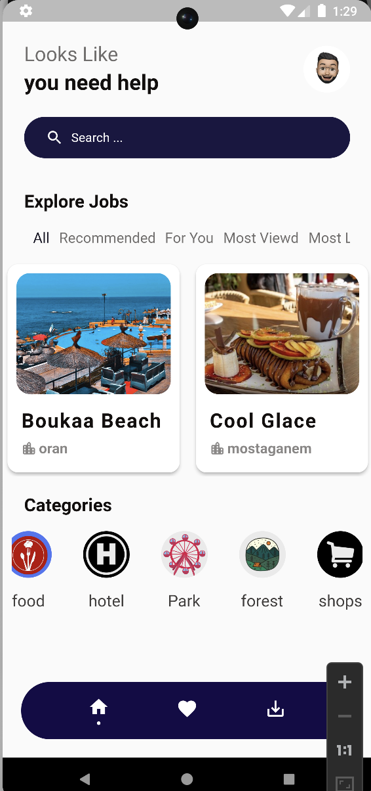

# irecommend

A new Flutter project.

## Getting Started

This project is a mobile app designed to help tourists discover Algeria's various locations from restaurants to shops and everything in between

####  
####
#### 
####
#### 
####
### What iRecomend can do for you :
We are interested in the field of place recommendation based on the preferences of different users,first I studied two-dimensional recommendation systems that are based on content, collaborative filtering or a hybridization between the two, then I exploited their algorithms and approaches to choose the algorithm that best suits the desired objectives.
In this project we developed a recommendation system that can recommend places to users, no matter how different they may be. Contextual parameters were taken into consideration, namely users preferred categories, sentiment analysis score, hashtags found in users comments, number of likes and views of each item, which allowed us to implement various recommendation algorithms such as:
###### The most popular recommendation
######
###### The most liked 
######
###### Recommendation by similarity

# iReccomend
